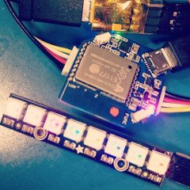
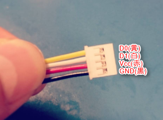
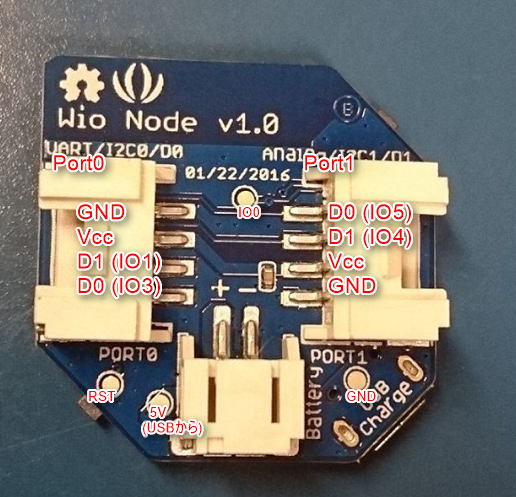
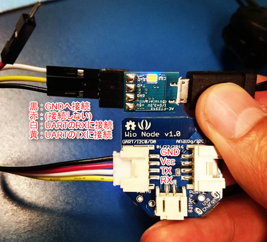

arduinoize_wio_node.ino
====
ArduinoからWioNodeを使うメモ

* 

参考URL
----
* http://wiki.seeed.cc/Wio_Node/
* http://blog.mobilehackerz.jp/2016/09/pclanwol.html
* http://qiita.com/binzume/items/e0c0234668992ef42f9a
* http://blogs.yahoo.co.jp/carcon999/39480359.html

注意点
---
IO15をHIGHにしないとGROVEコネクタのVccに3.3Vが供給されないらしい(節電用？)

以下のコードをsetup()関数に入れて、Vccに3.3Vを供給すること。

    void setup() {
      pinMode(15, OUTPUT);
      digitalWrite(15, HIGH);
    }

ピンアサイン
----
GROVEコネクタのピンアサインは次の通り

    D0  (黄色)
    D1  (白)
    Vcc (赤)
    GND (黒)

WioNodeをArduino化したときのピンアサインは次の通り。

    PORT0 D0 (UART RX)    → IO3
    PORT0 D1 (UART TX)    → IO1
    
    PORT1 D0 (I2C SCL)    → IO5
    PORT1 D1 (I2C SDA)    → IO4
    
    FUNCボタン            → IO0 (ボタンを押すとLOW, 離すとHIGH)
    
    LED青                 → IO2  (LOWにすると点灯、HIGHにすると消灯)
    LED赤(電源供給と兼用) → IO15 (必ずHIGHにしておくこと)

書き込み時の接続
----
Arduinoからスケッチを書き込む際は、USB-UARTとWioNodeは次のように接続する。

    WioNode PORT0         USB-UARTな何か(3.3V)
    
    D0  (黄色) (RX)   ←  TX
    D1  (白)   (TX)   →  RX
    Vcc (赤)
    GND (黒)          ⇔  GND

手元では、秋月の[これ](http://akizukidenshi.com/catalog/g/gM-08461/)を使ってます。

Arduinoの書き込み用設定
----

    ボード          : Generic ESP8266 Module
    Flash Mode      : DIO
    Flash Frequency : 40Mhz
    CPU Frequency   : 80Mhz
    Flash Size      : 4M(3M SPIFFS)
    Debug port      : disabled
    Debug level     : なし
    Reset Method    : ck          ←ここがESP-WROOM-02とちょっと違う
    Upload Speed    : 115200

書き込み時の操作手順
----
WioNodeとPCがUARTで接続されている状態で、次の手順でスケッチを書き込む。

- 1. FUNCのボタンを押しっぱなしにする (IO0をLOW)
- 2. RSTボタンを押す
- 3. RSTボタンを離す
- 4. FUNCのボタンを離す
- 5. Arduinoで書き込みボタンを押す

Copyright and license
----

Copyright (c) 2016 yoggy

Released under the [MIT license](LICENSE.txt)